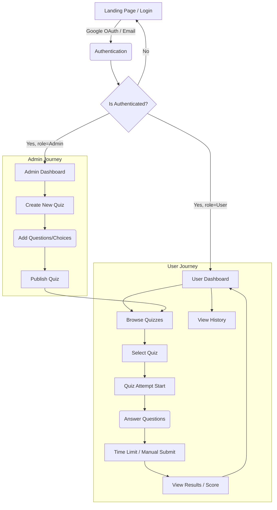

# Quiz Portal — Enterprise SaaS Application

A modern, production-grade quiz platform built with **Django + DRF** (backend) and **React + TypeScript** (frontend). Features a dark-mode SaaS dashboard with Google OAuth, real-time quiz timers, analytics, and enterprise-grade project structure.

---

## 🏗️ Architecture

```
quiz-portal/
├── backend/                     # Django + DRF
│   ├── config/                  # Project settings, URLs, WSGI
│   │   ├── settings.py
│   │   ├── urls.py
│   │   └── wsgi.py
│   ├── apps/
│   │   ├── accounts/            # Auth, Google OAuth, JWT
│   │   │   ├── models.py        # Custom User model
│   │   │   ├── repositories.py  # Data access layer
│   │   │   ├── services.py      # Auth business logic
│   │   │   ├── serializers.py
│   │   │   ├── views.py
│   │   │   └── urls.py
│   │   ├── quizzes/             # Quiz domain
│   │   │   ├── models.py        # Quiz, Question, Choice, Category
│   │   │   ├── repositories.py
│   │   │   ├── services.py
│   │   │   ├── serializers.py
│   │   │   ├── views.py
│   │   │   └── urls.py
│   │   └── attempts/            # Quiz submissions & scoring
│   │       ├── models.py        # Attempt, AttemptAnswer
│   │       ├── repositories.py
│   │       ├── services.py
│   │       ├── serializers.py
│   │       ├── views.py
│   │       └── urls.py
│   ├── manage.py
│   ├── requirements.txt
│   └── .env.example
│
└── frontend/                    # React + TypeScript (Vite)
    ├── src/
    │   ├── api/                 # Axios client + API modules
    │   ├── components/          # UI components by feature
    │   │   ├── auth/            # Login, Auth context, ProtectedRoute
    │   │   ├── dashboard/       # Stat cards, charts, activity feed
    │   │   ├── layout/          # Sidebar, DashboardLayout
    │   │   ├── quiz/            # QuizList, QuizAttempt, QuizResult
    │   │   ├── history/         # HistoryPage
    │   │   └── results/         # ResultPage
    │   ├── contexts/            # React contexts
    │   ├── hooks/               # Custom hooks
    │   ├── types/               # TypeScript type definitions
    │   ├── App.tsx              # Router
    │   ├── main.tsx             # Entry point
    │   └── index.css            # Design system
    ├── index.html
    ├── package.json
    ├── tsconfig.json
    └── vite.config.ts
```

### Enterprise Patterns Used

| Pattern | Implementation |
|---------|---------------|
| **Repository** | Each app has `repositories.py` encapsulating all DB queries |
| **Service Layer** | Business logic in `services.py`, views are thin |
| **Serializer Layer** | DRF serializers for input validation + output formatting |
| **API Layer (FE)** | `src/api/` with Axios client + typed API functions |
| **JWT + Interceptors** | Auto token refresh on 401, stored in localStorage |

---

## 🚀 Getting Started

### Prerequisites

- Python 3.10+
- Node.js 18+
- PostgreSQL 14+ (or use SQLite fallback for local dev)

### Backend Setup

```bash
cd quiz-portal/backend

# Create virtual environment
python -m venv venv
# Windows:
venv\Scripts\activate
# macOS/Linux:
# source venv/bin/activate

# Install dependencies
pip install -r requirements.txt

# Copy env file and configure
cp .env.example .env
# Edit .env with your settings

# Run migrations
python manage.py migrate

# Seed demo quizzes
python manage.py seed_quizzes

# Create superuser (optional, for admin panel)
python manage.py createsuperuser

# Start server
python manage.py runserver
```

### Frontend Setup

```bash
cd quiz-portal/frontend

# Install dependencies
npm install

# Start dev server (proxies API to Django)
npm run dev
```

Open **http://localhost:5173** in your browser.

---

## 📡 API Endpoints

### Authentication
| Method | Endpoint | Description |
|--------|----------|-------------|
| POST | `/api/auth/google/login/` | Exchange Google token for JWT |
| POST | `/api/auth/token/refresh/` | Refresh access token |
| GET | `/api/auth/profile/` | Get current user profile |
| PATCH | `/api/auth/profile/` | Update profile |

### Quizzes
| Method | Endpoint | Description |
|--------|----------|-------------|
| GET | `/api/quizzes/` | List quizzes (paginated, filterable) |
| GET | `/api/quizzes/:id/` | Quiz detail with questions |
| GET | `/api/quizzes/categories/` | List categories |

### Attempts
| Method | Endpoint | Description |
|--------|----------|-------------|
| POST | `/api/attempts/start/` | Start a new attempt |
| POST | `/api/attempts/:id/submit/` | Submit answers |
| GET | `/api/attempts/:id/` | Attempt detail with answers |
| GET | `/api/attempts/history/` | User's attempt history |
| GET | `/api/attempts/stats/` | Aggregated statistics |

---

## 🔐 Google OAuth Setup

1. Go to [Google Cloud Console](https://console.cloud.google.com/)
2. Create a new project → Enable Google+ API
3. Create OAuth 2.0 credentials (Web application)
4. Set authorized redirect URIs: `http://localhost:5173`
5. Add credentials to `.env`:
   ```
   GOOGLE_CLIENT_ID=your-client-id
   GOOGLE_CLIENT_SECRET=your-client-secret
   ```

---

## 🎨 UI Features

- **Dark-mode SaaS dashboard** with glassmorphism cards
- **Sidebar navigation** with active state indicators
- **Animated stat widgets** (total quizzes, avg score, accuracy)
- **Score charts** with bar animations
- **Quiz cards** with category badges and difficulty indicators
- **Real-time countdown timer** with danger state
- **Animated SVG score ring** on results page
- **Skeleton loading** states
- **Responsive design** — mobile to desktop

---

## 📦 Tech Stack

| Layer | Technology |
|-------|-----------|
| Frontend | React 18, TypeScript, Vite |
| Styling | Vanilla CSS with custom design system |
| API Client | Axios with JWT interceptors |
| Backend | Django 4.2, Django REST Framework |
| Auth | Google OAuth → JWT (SimpleJWT) |
| Database | PostgreSQL (SQLite fallback) |
| Fonts | Inter (Google Fonts) |

---

## 🌊 Application Flow Chart

The following flowchart outlines the core user journey, from authentication through completing a quiz and checking the dashboard.



---

## 🖼️ UI Screens Reference

All UI screens and mockups are located in the `/screens` directory at the root of the repository.
- `screens/01-login.png` - Login and registration interface with Google OAuth.
- `screens/02-dashboard.png` - Overview dashboard showing stats and recent activity.
- `screens/03-quiz-list.png` - List of available quizzes with category filtering.
- `screens/04-quiz-attempt.png` - Active quiz with countdown timer.
- `screens/05-results.png` - Post-quiz results with circular progress chart.
- `screens/06-admin-create.png` - Admin interface for creating questions and choices.

*(If viewing on GitHub, simply navigate to the `/screens` folder in this repository to see all image assets).*

---

## ⚙️ Environment Configuration

This project defines specific environment variables required to run optimally.

### Backend (`backend/.env`)
Create `.env` using `.env.example`:
- `DEBUG`: Set to `True` for development, `False` for production.
- `SECRET_KEY`: Django cryptographic key.
- `DATABASE_URL` (optional): PostgreSQL connection string. If omitted, falls back to `db.sqlite3`.
- `GOOGLE_CLIENT_ID` / `GOOGLE_CLIENT_SECRET`: Required for Google login. Look at `setup` instructions.

### Frontend (`frontend/.env`)
Create `.env` using `.env.example`:
- `VITE_API_BASE_URL`: Pointer to backend (e.g. `http://localhost:8000/api`).
- `VITE_GOOGLE_CLIENT_ID`: Public Google OAuth client ID.

---

## 🤔 Assumptions & Trade-offs

1. **Database Fallback:** For rapid evaluation and easy local setup, the backend defaults to SQLite if no `DATABASE_URL` is provided. The repository explicitly includes instructions and is fully pre-configured to use PostgreSQL when `DATABASE_URL` is set in production.
2. **Local Storage JWTs:** For simplicity and cross-domain proxy ease during development, JWT access and refresh tokens are stored in `localStorage` in the React frontend. In a strictly enterprise environment, HttpOnly cookies would be preferred for the refresh token.
3. **Admin Identification:** The system relies on Django's native `is_staff` field to determine if a user has "Admin" rights. This avoids over-engineering a separate custom `Role` table while efficiently serving the requirements of distinguishing an admin user (who can create quizzes) from a regular user.
4. **Synchronous Grading:** Quiz grading happens synchronously upon submission and recalculates the final score before returning the response payload. As quiz scales are relatively small, avoiding asynchronous task queueing (like Celery) keeps the architectural footprint light.
5. **Atomic Transactions:** The quiz creation endpoint wraps creation of the Question, Choices, and Quiz into a single `db.transaction.atomic()` block. If any nested element fails to validate, nothing is written.

---

## 📦 Deployment Guidance

For complete instructions on deploying this independent frontend and full-stack backend (e.g. Vercel for React, Render/Railway for Django+DB), please consult [DEPLOYMENT.md](./DEPLOYMENT.md).

For setting up the exact database schemas, triggers, and local data, consult [SETUP.md](./SETUP.md).
